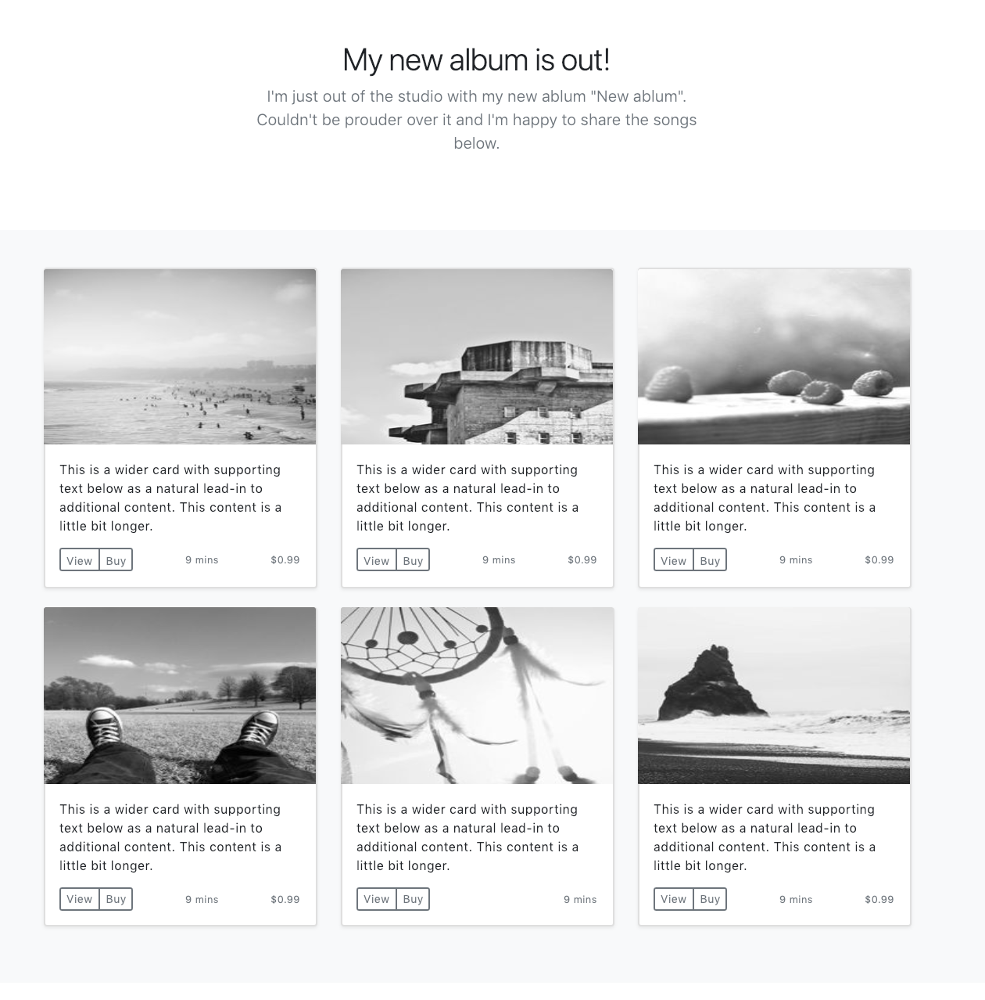

# CSS Design Replication Challenge

A quick project to demonstrate how closely I can replicate/copy a given design. The result can be viewed [here on Github Pages](https://petter0619.github.io/copy-a-design/).

## Specification

Make a complete HTML page looking like the design below on desktop. Unfortunately, the designer was very busy and did not have time to finalize the mobile layout. But the specification says that the mobile view should show only one image per row (like Instagram).

The CSS should be crafted with:

* A *mobile first* approach.
* Consideration for different browsers' compatibility. We want you to support Internet Explorer 11 as well as modern browsers such as Chrome and Safari.
* A consistent naming convention and code style.
* You may **not** use Bootstrap, jQuery or similar.

